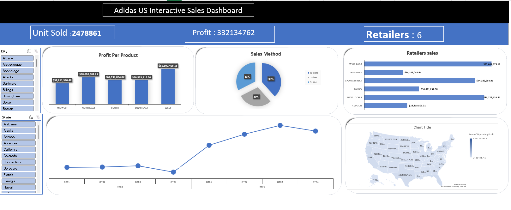

# Excel_dashboard_Test
Project for data analyst course
# Adidas US Interactive Sales Dashboard

## 📊 Project Overview

The **Adidas US Interactive Sales Dashboard** is a comprehensive business intelligence solution designed to analyze and visualize Adidas sales performance across the United States. This dashboard provides a high-level executive summary along with detailed regional, retailer, and sales method breakdowns to support data-driven decision-making.

The dashboard consolidates sales, profit, and distribution insights into an intuitive and interactive layout suitable for business stakeholders, analysts, and strategic planners.

---

## 🎯 Objectives

- Monitor overall sales performance
- Track total units sold and total profit
- Compare profitability by region
- Analyze sales distribution by sales method
- Evaluate retailer performance
- Identify geographic trends in operating profit
- Enable dynamic filtering by city and state

---

## 📌 Key Performance Indicators (KPIs)

At the top of the dashboard, three primary KPIs provide a snapshot of performance:

| KPI | Value |
|-----|-------|
| **Units Sold** | 2,478,861 |
| **Total Profit** | 332,134,762 |
| **Number of Retailers** | 6 |

These KPIs allow executives to quickly assess overall business health.

---

## 📈 Dashboard Components

### 1️⃣ Profit Per Product (Region-Based)

A vertical bar chart displays profit distribution across US regions:

- **Midwest**
- **Northeast**
- **South**
- **Southeast**
- **West**

#### Insight:
- The **West region** generates the highest profit.
- All regions contribute significantly, indicating strong nationwide distribution.

This visualization supports regional performance comparison and territory optimization strategies.

---

### 2️⃣ Sales Method Distribution

A pie chart represents sales contribution by channel:

- **In-store** (~38%)
- **Online** (~33%)
- **Outlet** (~29%)

#### Insight:
- In-store sales slightly dominate.
- Online sales represent a substantial share, reflecting strong digital performance.
- Outlet sales remain an important secondary channel.

This breakdown helps evaluate omnichannel strategy effectiveness.

---

### 3️⃣ Retailers Sales Comparison

A horizontal bar chart compares total sales by retailer:

- West Gear
- Walmart
- Sports Direct
- Kohl’s
- Foot Locker
- Amazon

#### Insight:
- **West Gear** and **Foot Locker** are among the top contributors.
- Amazon and Walmart provide strong performance through broader distribution.
- Retail partnerships significantly influence overall revenue.

This component enables retailer-level performance analysis and partnership evaluation.

---

### 4️⃣ Quarterly Sales Trend (2020–2021)

A line chart tracks performance across quarters:

- Q1 2020 – Q4 2020
- Q1 2021 – Q4 2021

#### Insight:
- Slight dip in Q4 2020.
- Strong growth throughout 2021.
- Peak performance observed around Q3 2021.

This visualization helps detect seasonality, growth patterns, and post-pandemic recovery trends.

---

### 5️⃣ US Geographic Profit Distribution

A US map visualizes operating profit by state using color intensity.

- Darker shades represent higher operating profit.
- Enables quick identification of high-performing states.

#### Insight:
- Certain states significantly outperform others.
- Geographic concentration of profitability can inform expansion strategies.

---

### 6️⃣ Interactive Filters

The dashboard includes:

- **City filter**
- **State filter**

Users can dynamically filter the dashboard to analyze performance at more granular geographic levels.

---

## 🛠️ Tools & Technologies

This dashboard was built using:

- Microsoft Power BI (Data Modeling & Visualization)
- DAX (Calculated Measures & KPIs)
- Interactive slicers for dynamic filtering
- Map visualizations for geographic analysis

---

## 📊 Data Model Overview

The dataset includes:

- Sales transactions
- Units sold
- Revenue
- Operating profit
- Retailer information
- Sales method
- Region
- City
- State
- Date (Quarter & Year)

The data model enables multidimensional analysis across:

- Time
- Geography
- Channel
- Retailer
- Product/Region

---

## 💡 Business Value

This dashboard enables:

- Executive-level performance monitoring
- Regional performance optimization
- Retailer performance benchmarking
- Channel strategy evaluation
- Trend and seasonality detection
- Data-driven strategic planning

It provides both high-level summaries and detailed analytical insights within a single interactive interface.

---

## 🚀 How to Use

1. Use the **City** and **State** slicers to filter data.
2. Review KPIs for quick performance assessment.
3. Analyze charts for trends, comparisons, and geographic patterns.
4. Drill down into regions and retailers for deeper insights.

---

## 📌 Conclusion

The Adidas US Interactive Sales Dashboard delivers a complete, interactive overview of Adidas sales performance across the United States. It combines strategic KPIs, regional analysis, channel distribution, retailer benchmarking, and geographic intelligence into a unified decision-support tool.

This project demonstrates strong capabilities in:

- Data visualization
- Business intelligence design
- Analytical storytelling
- Dashboard structuring
- KPI modeling

---

## 👩‍💻 Author

**Doaa Sobhy**

---

If you found this project useful or insightful, feel free to ⭐ star the repository.

